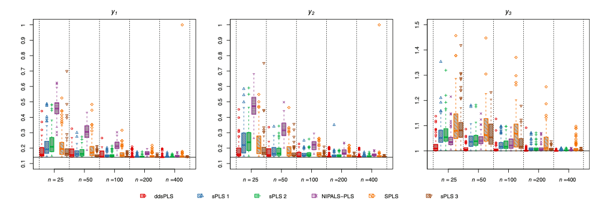
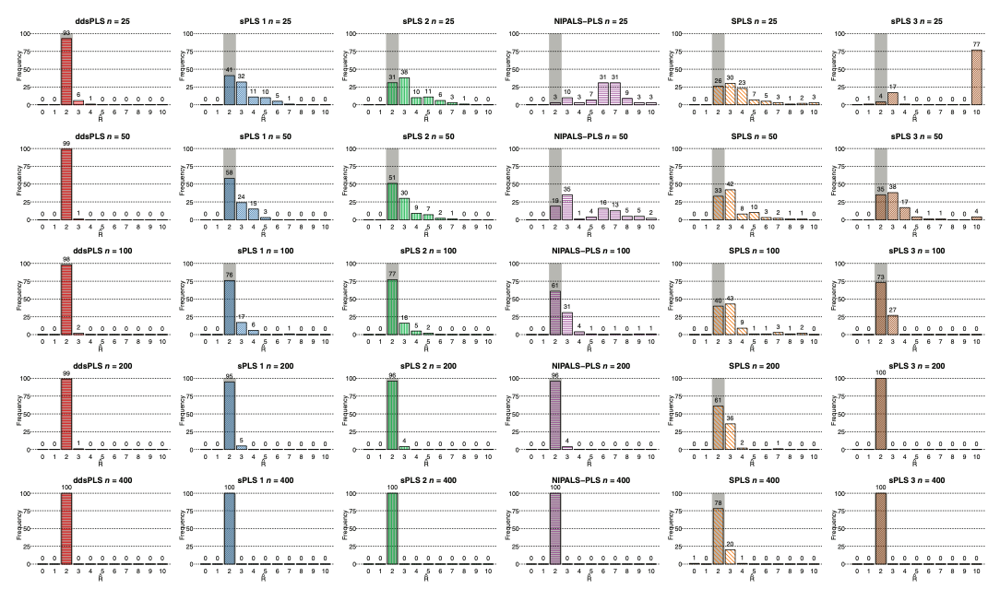

```{r xaringan-themer, include=FALSE, warning=FALSE}
library(xaringanthemer)

style_xaringan(base_font_size = "27px",
               text_color = "#515151",
               background_color ="#CFEEFA",
               title_slide_text_color = "#2b2b2b",
               title_slide_background_color = "#CFEEFA",
               text_font_google   = google_font("Roboto Serif", "400"))
```


## Partial Least Squares


- Partial Least Squares (PLS) is a regression method similar to Principal Component Regression (PCR).

- PLS is also called "Projection onto Latent Structures", this name is more informative about the method.

- Instead of building latent variables using the variance matrix for predictors as in PCR, PLS uses the covariance matrix. This causes the latent variables to be more associated with the response.

---

## Sparse Partial Least Squares

- Sparse Partial Least Squares (sPLS) is similar to PLS with added sparsity terms.

- The $L_1$ norm is commonly used, making this method somewhat similar to LASSO.

- In sPLS, the $L_1$ norm is used to make eigenvectors of the estimated covariance more sparse.

- The coefficient $\lambda$ is used as a parameter for the level of sparsity. Is $\lambda = 0$, the results of the sPLS and PLS will be the same. If $\lambda = 1$ sPLS is the same as using mean estimation.

---

## Data-Driven Sparse Partial Least Squares

- Data-Driven Sparse Partial Least Squares (ddsPLS) is a PLS method recently proposed by Hadrien Lorenzo.

- ddsPLS performs variable selection for both predictors and response.

- Unlike many other sPLS methods, ddsPLS uses bootstrapping for parameter selection.

- Parameter selection is done by minimizing $\bar{R^2_B} - \bar{Q^2_B}$.

---

## Data-Driven Sparse Partial Least Squares

For all $r \in [1:R]$:

a. $\textbf{u}_r = \overrightarrow{RSV}(S_{\lambda^{(r)}}(M^{(r)}))$, $\textbf{v}_r = \overrightarrow{RSV}(S_{\lambda^{(r)}}({M^{(r)}}^T))$

b. $\textbf{t}_r = \textbf{X}^{(r)} \textbf{u}_r$

c. $\textbf{p}_r = \frac{{\textbf{X}^{(r)}}^T \textbf{t}_r}{{\textbf{t}_r}^T \textbf{t}_r}$

---

## Model Comparison



ddsPLS performs well across response variables and sample sizes when comparing RMSE for simulated data to other PLS methods.

---

## Model Comparison

